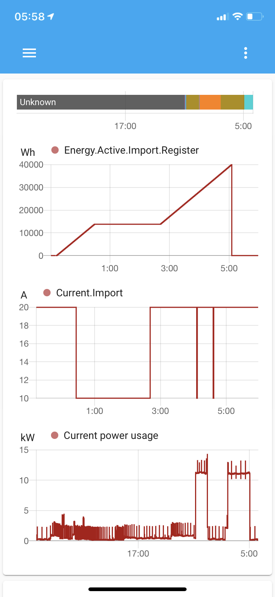

# OCPP

This is a home assistant integration for a simple OCPP server (central system) for chargers that support the Open Charge Point Protocol.

* based on the [Python OCPP Package](https://github.com/mobilityhouse/ocpp).
* [HACS](https://hacs.xyz/) compatible repository 

## Installation

1. install [HACS](https://hacs.xyz/)
2. add this repository as a Custom repository in HACS 
3. search for the ocpp integration and install
4. add the ocpp platform configuration (see below) to configuration.yaml
5. restart home assistant

## Example configuration

```yaml
sensor:
  - platform: ocpp
    monitored_variables:
      - "Current.Export"
      - "Current.Import"
      - "Current.Offered"
      - "Energy.Active.Export.Register"
      - "Energy.Active.Import.Register"
      - "Energy.Reactive.Export.Register"
      - "Energy.Reactive.Import.Register"
      - "Energy.Active.Export.Interval"
      - "Energy.Active.Import.Interval"
      - "Energy.Reactive.Export.Interval"
      - "Energy.Reactive.Import.Interval"
      - "Frequency"
      - "Heartbeat"
      - "Power.Active.Export"
      - "Power.Active.Import"
      - "Power.Factor"
      - "Power.Offered"
      - "Power.Reactive.Export"
      - "Power.Reactive.Import"
      - "RPM"
      - "SoC"
      - "Status"
      - "Temperature"
      - "Voltage"
    port: 9000
    scan_interval:
      seconds: 60
```

## Screenshot



